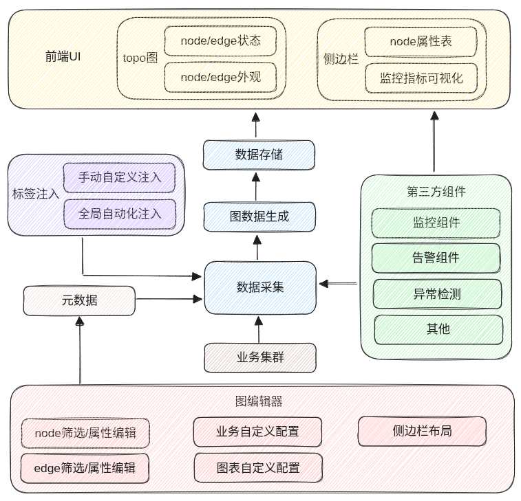
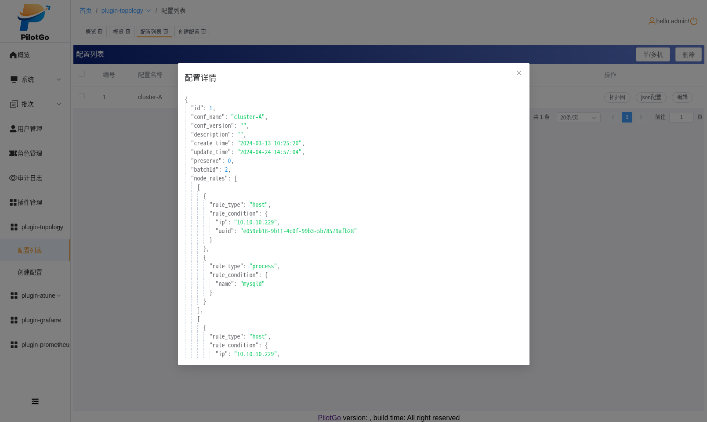

# PilotGo-plugin-topology

#### 介绍
System application architecture detection.

#### 软件架构
1. 系统环境: 
- agent: Kylin-Server-V10-SP3、nestos、openEuler-22.03-LTS-SP1
- server: Kylin-Desktop-V10-SP1、Kylin-Server-V10-SP3、nestos、openEuler-22.03-LTS-SP1、redhat9
2. 开发工具:
- golang >= 1.18、vue3、typescript、node.js > 14
3. 运行依赖组件:
- PilotGo
- neo4j(jvm)
- mysql
- redis






#### 安装及使用教程
work directory: PilotGo-plugin-topology/
1. 拉取仓库代码
```bash
$ git clone https://gitee.com/openeuler/PilotGo-plugin-topology.git
```
2. 修改配置文件
```bash
$ mv topo_server.yaml.templete topo_server.yaml; vim topo_server.yaml
$ mv topo_agent.yaml.templete topo_agent.yaml; vim topo_agent.yaml
```
3. 前端编译
```bash
$ cd ./web
$ yarn install
$ yarn build
```
4. 后端编译
```bash
$ go build -mod=vendor -o topoagent agent/main.go
$ mv web/dist/* handler/
$ go build -mod=vendor -tags=production toposerver server/main.go
```
5. 运行
```bash
在管理节点启动PilotGo及其相关中间件，neo4j数据库；
$ ./toposerver -conf /path/to/topo_server.yaml
将topoagent、topo_agent.yaml部署至业务节点相应目录下；
$ ./topoagent -conf /path/to/topo_agent.yaml
```
6. 打开pilotgo web UI页面，添加并启动topology插件，查看拓扑图页面

#### 特技

1.  使用 Readme\_XXX.md 来支持不同的语言，例如 Readme\_en.md, Readme\_zh.md
2.  Gitee 官方博客 [blog.gitee.com](https://blog.gitee.com)
3.  你可以 [https://gitee.com/explore](https://gitee.com/explore) 这个地址来了解 Gitee 上的优秀开源项目
4.  [GVP](https://gitee.com/gvp) 全称是 Gitee 最有价值开源项目，是综合评定出的优秀开源项目
5.  Gitee 官方提供的使用手册 [https://gitee.com/help](https://gitee.com/help)
6.  Gitee 封面人物是一档用来展示 Gitee 会员风采的栏目 [https://gitee.com/gitee-stars/](https://gitee.com/gitee-stars/)
